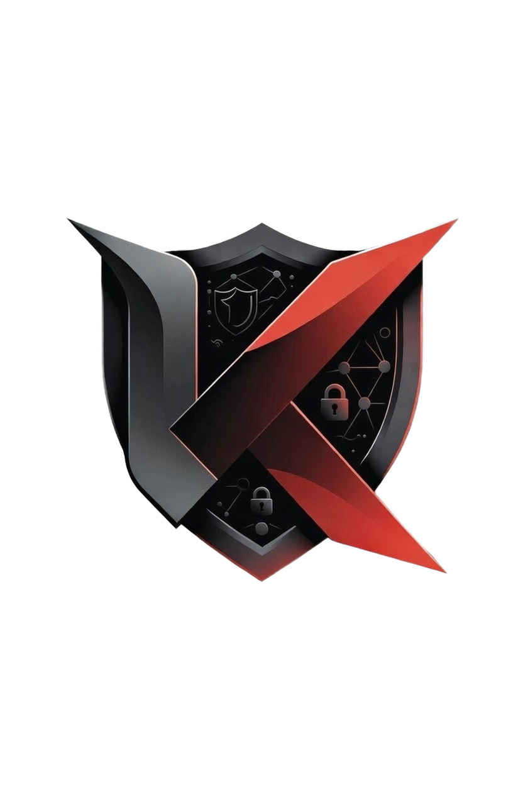

# KARDINAL Anty

### Антидетект-браузер нового поколения

[🌐 Сайт](https://www.kardinal-anty.group/) · [💬 Telegram](https://t.me/kardinal_anty) · [📦 Скачать](https://github.com/Kardinal-anty/KARDINAL_anty/releases/latest)

---

## 🔍 О проекте

**KARDINAL Anty** — мощный антидетект-браузер для управления множеством браузерных профилей с уникальными цифровыми отпечатками. Предназначен для специалистов в области маркетинга, арбитража трафика и мультиаккаунтинга.

## ✨ Возможности

| | Функция | Описание |
|---|---|---|
| 🎭 | **Антидетект** | Уникальный цифровой отпечаток для каждого профиля |
| 🌐 | **Прокси** | Поддержка HTTP, SOCKS5, SSH — с гибкой настройкой на профиль |
| 🔄 | **Синхронизация** | Облачная синхронизация профилей между устройствами |
| 📁 | **Группы и теги** | Удобная организация сотен профилей |
| 🍪 | **Cookie-менеджер** | Импорт и экспорт cookies |
| 🛡️ | **Camoufox** | Встроенная поддержка Camoufox для максимальной маскировки |
| 🔑 | **Шифрование** | Все данные надёжно зашифрованы |
| 🔄 | **Автообновления** | Обновления приложения прямо из GitHub Releases |
| 🌍 | **Мультиязычность** | Русский, English |

## 🖥️ Поддерживаемые платформы

| Платформа | Статус |
|---|---|
| Windows (x64) | ✅ |
| macOS (Intel / Apple Silicon) | ✅ |
| Linux (DEB / RPM / AppImage) | ✅ |

## ⚡ Быстрый старт

1. Скачайте последний релиз со [страницы загрузки](https://github.com/Kardinal-anty/KARDINAL_anty/releases/latest)
2. Установите приложение
3. Создайте первый профиль и начните работу

## 🛠️ Стек технологий

- **Frontend:** Next.js, React, TypeScript, Tailwind CSS
- **Backend:** Rust, Tauri 2
- **Движки:** Camoufox (Firefox), Wayfern (Chromium)

## 📬 Контакты

- 🌐 **Сайт:** [kardinal-anty.group](https://www.kardinal-anty.group/)
- 💬 **Telegram:** [@kardinal_anty](https://t.me/kardinal_anty)

## 📄 Лицензия

Проект распространяется под лицензией [AGPL-3.0](LICENSE).

---

**⭐ Поставьте звезду, если проект оказался полезен!**

